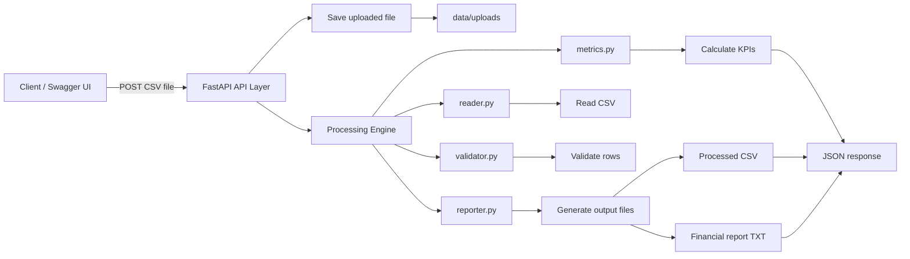
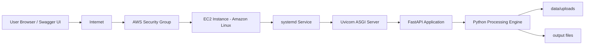

# Financial Data Processor API — FastAPI + AWS EC2 Deployment


A backend API built with **Python, FastAPI, Pandas, and AWS EC2** to validate financial CSV files, detect data quality issues, calculate financial KPIs, generate processed output files, and return structured JSON responses.

This project demonstrates the evolution of a local financial automation script into a cloud-hosted backend API:

```text
Local Python Script → FastAPI Backend API → AWS EC2 Deployment
```

---

## Table of Contents

- [Overview](#overview)
- [Business Problem](#business-problem)
- [Solution](#solution)
- [Live Demo / Cloud Deployment](#live-demo--cloud-deployment)
- [Key Features](#key-features)
- [Architecture](#architecture)
- [AWS Deployment Architecture](#aws-deployment-architecture)
- [Project Structure](#project-structure)
- [Tech Stack](#tech-stack)
- [How to Run Locally](#how-to-run-locally)
- [How to Deploy on AWS EC2](#how-to-deploy-on-aws-ec2)
- [Managing the API as a Linux Service](#managing-the-api-as-a-linux-service)
- [API Endpoints](#api-endpoints)
- [Expected CSV Format](#expected-csv-format)
- [Example Response](#example-response)
- [Error Handling](#error-handling)
- [Technical Challenges Solved](#technical-challenges-solved)
- [Portfolio Value](#portfolio-value)
- [Limitations](#limitations)
- [Next Steps](#next-steps)
- [Author](#author)

---

## Overview

**Financial Data Processor API** is a backend service that receives financial CSV files, validates their structure and records, calculates key financial metrics, and returns a structured JSON response.

The API is designed around a common backoffice problem: finance and operations teams often receive CSV exports from different systems and need a fast, repeatable way to validate data before using it for analysis, reporting, or decision-making.

The project started as a local Python data processor and was later exposed through a FastAPI backend. It is now deployed on an AWS EC2 instance using Uvicorn and managed as a persistent Linux service with `systemd`.

---

## Business Problem

Financial teams frequently work with exported CSV files from:

- ERP systems
- Marketplaces
- Banking platforms
- Payment gateways
- Internal spreadsheets
- Finance and accounting workflows

These files may contain:

- Missing required columns
- Invalid dates
- Non-numeric financial values
- Incorrect transaction categories
- Empty required fields
- Data inconsistencies that can affect reports and business decisions

Manual validation is repetitive, slow, and error-prone.

---

## Solution

This API automates the workflow:

1. Receives a CSV file through an HTTP upload
2. Saves the uploaded file locally
3. Calls a reusable financial processing engine
4. Validates required columns and row-level data
5. Adds validation status and validation messages
6. Calculates financial KPIs
7. Generates processed output files
8. Returns a structured JSON response
9. Runs on AWS EC2 as a persistent backend service

The API layer does **not** contain the business rules directly.  
The business logic is isolated inside `src/`, while FastAPI acts as the HTTP interface.

---

## Live Demo / Cloud Deployment

The API was deployed to an **AWS EC2 instance** using:

- Amazon Linux 2023
- Python virtual environment
- FastAPI
- Uvicorn
- Security Groups
- `systemd` service management

During the deployment stage, the application was made accessible through:

```text
http://<EC2_PUBLIC_IP>:8000/health
http://<EC2_PUBLIC_IP>:8000/docs
```

> Note: the public EC2 IP may change if the instance is stopped and started without an Elastic IP. For security and cost control, the live endpoint may not always remain active.

---

## Key Features

- Upload financial CSV files through a FastAPI endpoint
- Validate required CSV columns
- Validate records row by row
- Detect invalid financial records
- Calculate financial KPIs
- Generate processed CSV output
- Generate financial report file
- Return structured JSON responses
- Provide validation summary and data preview
- Keep API layer separated from business logic
- Deploy the API to AWS EC2
- Run the API as a persistent Linux service with `systemd`

---

## Architecture




### Responsibility Split

| Layer | Responsibility |
|---|---|
| `app/` | HTTP layer, API routes, upload handling, JSON responses |
| `src/` | Business logic, CSV reading, validation, KPI calculation, report generation |
| `data/uploads/` | Stores uploaded CSV files |
| `output/` | Stores generated processed data and report files |
| AWS EC2 | Hosts the backend API |
| systemd | Keeps the API running as a Linux service |

---

## AWS Deployment Architecture



### AWS Components Used

| AWS / Linux Component | Purpose |
|---|---|
| Amazon EC2 | Hosts the API server |
| Security Group | Controls inbound and outbound traffic |
| Public IPv4 | Allows external access during the demo |
| SSH Key Pair | Secure access to the EC2 instance |
| Amazon Linux 2023 | Server operating system |
| systemd | Automatically starts and restarts the API service |

### Security Group Rules Used During Testing

| Direction | Type | Port | Source / Destination | Purpose |
|---|---|---:|---|---|
| Inbound | SSH | 22 | My IP | EC2 administration |
| Inbound | Custom TCP | 8000 | 0.0.0.0/0 | Public API testing |
| Outbound | All traffic | All | 0.0.0.0/0 | Package installation and internet access |

> For production, port `8000` should normally be placed behind Nginx, a load balancer, HTTPS, authentication, or a more controlled network configuration.

---

## Project Structure

```bash
financial-data-processor-api/
│
├── app/
│   ├── __init__.py
│   └── main.py              # FastAPI application and API endpoints
│
├── src/
│   ├── __init__.py
│   ├── reader.py            # CSV reading logic
│   ├── validator.py         # Column and row validation logic
│   ├── metrics.py           # Financial KPI calculation
│   ├── reporter.py          # Output file generation
│   └── processor.py         # Main processing pipeline
│
├── data/
│   └── uploads/             # Uploaded CSV files
│
├── output/                  # Processed files and reports
│
├── examples/                # Sample CSV files for testing
│
├── assets/                  # Architecture diagrams
├── requirements.txt
├── README.md
└── .gitignore
```

---

## Tech Stack

| Technology | Purpose |
|---|---|
| Python 3.9+ | Main programming language |
| FastAPI | Backend API framework |
| Pandas | CSV and data processing |
| Uvicorn | ASGI server |
| Swagger UI | Automatic API documentation and endpoint testing |
| AWS EC2 | Cloud hosting |
| Amazon Linux 2023 | Server operating system |
| systemd | Service management and automatic startup |
| Git / GitHub | Version control and portfolio documentation |

---

## How to Run Locally

### 1. Clone the repository

```bash
git clone https://github.com/RafaelStevanato/financial-data-processor-api.git
cd financial-data-processor-api
```

### 2. Create a virtual environment

```bash
python -m venv venv
```

### 3. Activate the virtual environment

Windows PowerShell:

```bash
.\venv\Scripts\Activate.ps1
```

Linux / macOS:

```bash
source venv/bin/activate
```

### 4. Install dependencies

```bash
pip install -r requirements.txt
```

### 5. Run the API

```bash
uvicorn app.main:app --reload
```

### 6. Open Swagger documentation

```text
http://127.0.0.1:8000/docs
```

---

## How to Deploy on AWS EC2

### 1. Connect to the EC2 instance

For Amazon Linux:

```bash
ssh -i "path/to/key.pem" ec2-user@<EC2_PUBLIC_IP>
```

### 2. Install required packages

```bash
sudo yum update -y
sudo yum install python3 git -y
```

### 3. Clone the repository

```bash
git clone https://github.com/RafaelStevanato/financial-data-processor-api.git
cd financial-data-processor-api
```

### 4. Create and activate the virtual environment

```bash
python3 -m venv venv
source venv/bin/activate
```

### 5. Install dependencies

```bash
pip install -r requirements.txt
```

### 6. Run manually for initial testing

```bash
uvicorn app.main:app --host 0.0.0.0 --port 8000
```

### 7. Test from a browser

```text
http://<EC2_PUBLIC_IP>:8000/health
http://<EC2_PUBLIC_IP>:8000/docs
```

---

## Managing the API as a Linux Service

The API is configured to run as a `systemd` service.

### Service file path

```bash
/etc/systemd/system/fdp-api.service
```

### Example service configuration

```ini
[Unit]
Description=Financial Data Processor API
After=network.target

[Service]
User=ec2-user
WorkingDirectory=/home/ec2-user/financial-data-processor-api
ExecStart=/home/ec2-user/financial-data-processor-api/venv/bin/uvicorn app.main:app --host 0.0.0.0 --port 8000
Restart=always

[Install]
WantedBy=multi-user.target
```

### Enable and start the service

```bash
sudo systemctl daemon-reload
sudo systemctl enable fdp-api
sudo systemctl start fdp-api
```

### Useful service commands

```bash
sudo systemctl status fdp-api
sudo systemctl restart fdp-api
sudo systemctl stop fdp-api
journalctl -u fdp-api -f
```

---

## API Endpoints

### GET `/health`

Checks if the API is running.

#### Example Response

```json
{
  "status": "ok",
  "service": "financial-data-processor-api",
  "version": "1.0.0"
}
```

---

### POST `/process-csv`

Uploads and processes a financial CSV file.

#### Input

- Content type: `multipart/form-data`
- Field name: `file`
- File type: `.csv`

#### Processing Flow

```text
CSV upload → local save → processing engine → validation + KPIs → JSON response
```

---

## Expected CSV Format

The uploaded CSV must contain the following columns:

| Column | Description | Example |
|---|---|---|
| `date` | Transaction date | `2024-01-01` |
| `description` | Transaction description | `Sale A` |
| `amount` | Transaction amount | `100` or `-50` |
| `category` | Transaction type | `income` or `expense` |

### Example CSV

```csv
date,description,amount,category
2024-01-01,Sale A,100,income
2024-01-02,Expense B,-50,expense
2024-01-03,Sale C,200,income
```

---

## Example Response

```json
{
  "status": "success",
  "message": "File processed successfully",
  "kpis": {
    "total_income": 300,
    "total_expense": -50,
    "balance": 250,
    "total_transactions": 3,
    "valid_transactions": 3,
    "invalid_transactions": 0
  },
  "validation_summary": {
    "valid_rows": 3,
    "invalid_rows": 0,
    "invalid_rate": 0
  },
  "preview": [
    {
      "date": "2024-01-01",
      "description": "Sale A",
      "amount": 100,
      "category": "income",
      "validation_status": "valid",
      "validation_message": ""
    },
    {
      "date": "2024-01-02",
      "description": "Expense B",
      "amount": -50,
      "category": "expense",
      "validation_status": "valid",
      "validation_message": ""
    }
  ],
  "outputs": {
    "processed_data_file": "output/processed_YYYYMMDD_HHMMSS.csv",
    "financial_report_file": "output/report_YYYYMMDD_HHMMSS.txt"
  }
}
```

---

## Error Handling

### Invalid file type

If the uploaded file is not a CSV:

```json
{
  "detail": "Only CSV files are supported."
}
```

### Missing required columns

If the CSV does not contain all required columns:

```json
{
  "detail": "Missing required columns: ['category']"
}
```

---

## Technical Challenges Solved

This project involved practical debugging and deployment work beyond writing the API code.

| Challenge | Resolution |
|---|---|
| EC2 SSH access failed due to `.pem` permissions | Fixed Windows file permissions and used the correct Amazon Linux user: `ec2-user` |
| EC2 could receive SSH but could not install packages | Corrected Security Group outbound rules |
| API worked manually but stopped after closing terminal | Configured `systemd` service for persistent execution |
| Dependency installation failed on Python 3.9 | Rebuilt `requirements.txt` with compatible package versions |
| Pandas / NumPy binary incompatibility | Pinned compatible versions: `numpy==1.24.4` and `pandas==2.0.3` |
| Public access did not work initially | Used `--host 0.0.0.0` and opened TCP port `8000` |

---

## Portfolio Value

This project demonstrates practical skills relevant to backend, cloud, and data automation roles:

- Building APIs with FastAPI
- Handling file uploads
- Processing CSV data with Pandas
- Separating HTTP transport from business logic
- Returning structured JSON responses
- Deploying a backend API to AWS EC2
- Configuring Security Groups
- Managing Linux services with `systemd`
- Debugging cloud networking issues
- Managing Python dependency compatibility
- Documenting a technical project with business context

The project simulates a real workflow where raw financial CSV files need to be validated, summarized, and exposed through a backend service.

---

## Limitations

The current version intentionally keeps the scope focused:

- No authentication
- No database
- No Docker
- No HTTPS
- No custom domain
- Local EC2 file storage only
- Basic validation rules
- Single-file processing
- Public port `8000` used only for portfolio/demo purposes

These limitations are intentional for the MVP. The purpose of this version is to prove the complete path from local processing to API deployment.

---

## Next Steps

Planned improvements:

- Add automated tests with `pytest`
- Improve validation messages
- Add support for multiple validation errors per row
- Add structured logging
- Add S3 storage for uploaded and processed files
- Add Docker for portable deployment
- Add Nginx reverse proxy
- Add HTTPS
- Add a simple frontend upload interface
- Add authentication for controlled access

## AWS S3 Integration (Cloud Storage Layer)

This project was extended to include AWS S3 as the storage layer for both input and output files, transforming the API from a local file processor into a cloud-based data pipeline.

### What was implemented

- Created a dedicated S3 bucket for the project
- Structured storage using logical folders:
  - uploads/ → original CSV files
  - outputs/ → processed data and reports
- Configured IAM Role attached to EC2 instance
- Implemented least-privilege access policy (no full S3 access)
- Removed need for access keys in code (secure by design)

### Backend Changes

- Added boto3 integration
- Created a dedicated module:
  src/s3_storage.py
- Implemented reusable upload function for S3

Flow inside the API:

1. Receive CSV file via FastAPI endpoint
2. Save file temporarily on EC2
3. Process file (validation + KPI calculation)
4. Upload original file to S3 (uploads/)
5. Upload processed data to S3 (outputs/)
6. Upload generated report to S3 (outputs/)
7. Return structured JSON including S3 file paths

### Example Output

The API now returns both local paths and S3 URIs:

{
  "outputs": {
    "local_uploaded_file": "...",
    "local_processed_data_file": "...",
    "local_financial_report_file": "...",
    "s3_uploaded_file": "s3://bucket/uploads/file.csv",
    "s3_processed_data_file": "s3://bucket/outputs/data.csv",
    "s3_financial_report_file": "s3://bucket/outputs/report.txt"
  }
}

### Why this matters

Before:
- Files stored only on EC2
- Not persistent
- Not scalable

After:
- Files stored in S3 (durable and scalable)
- Separation of compute and storage
- Cloud-native architecture

### Key Concepts Applied

- IAM Role-based authentication
- Principle of least privilege
- Object storage design (S3)
- Backend integration with cloud services
- End-to-end data pipeline (upload → process → store → return)

This upgrade significantly improves the real-world relevance of the project by introducing a proper cloud storage layer aligned with production architectures.

---

## Author

**Rafael Stevanato**

Portfolio focus:

- Python
- FastAPI
- AWS cloud deployment
- Financial data automation
- Backend APIs
- Cloud-ready workflows