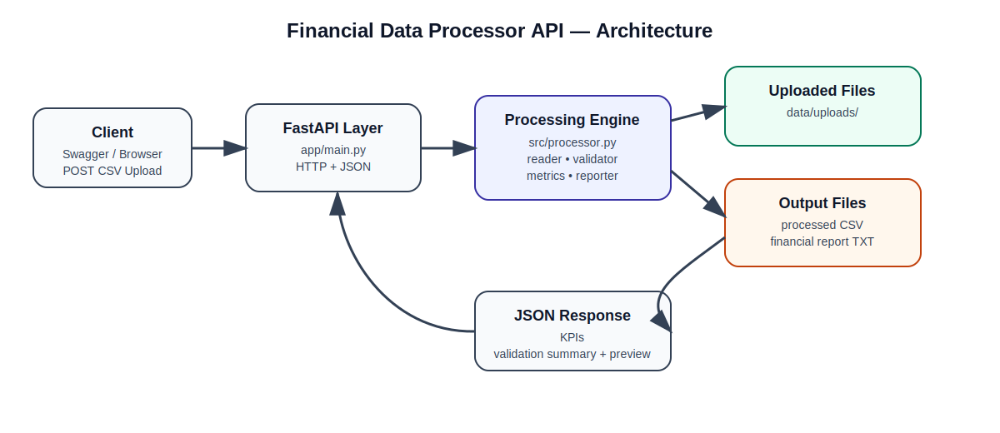
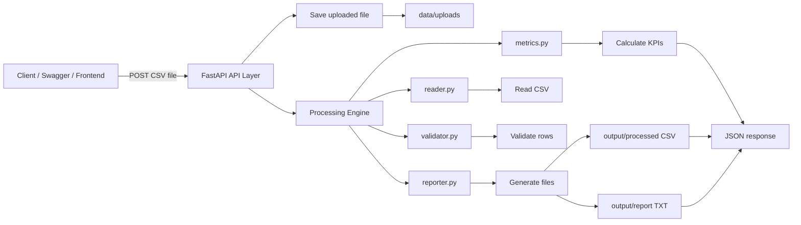

# Financial Data Processor API — FastAPI CSV Validation & KPI Engine


A backend API built with **Python, FastAPI, and Pandas** to validate financial CSV files, detect data quality issues, calculate financial KPIs, generate processed output files, and return structured JSON responses.

This project is part of a larger portfolio path focused on **financial data automation, backend APIs, and cloud-ready processing workflows**.

---

## Table of Contents

- [Overview](#overview)
- [Business Problem](#business-problem)
- [Solution](#solution)
- [Key Features](#key-features)
- [Architecture](#architecture)
- [Project Structure](#project-structure)
- [Tech Stack](#tech-stack)
- [How to Run](#how-to-run)
- [API Endpoints](#api-endpoints)
- [Expected CSV Format](#expected-csv-format)
- [Example Response](#example-response)
- [Error Handling](#error-handling)
- [Relationship with Project 1](#relationship-with-project-1)
- [Portfolio Value](#portfolio-value)
- [Limitations](#limitations)
- [Next Steps](#next-steps)
- [Author](#author)

---

## Overview

**Financial Data Processor API** exposes a reusable financial data processing engine through a local HTTP API.

The API allows a user to upload a CSV file and receive:

- Financial KPIs
- Validation status
- Valid and invalid transaction counts
- Processed file paths
- Preview of processed records
- Structured JSON response

The goal is to simulate a real-world backoffice problem: financial teams often receive CSV files from different systems and need a reliable way to validate, clean, and summarize the data before analysis.

---

## Business Problem

Financial and operations teams often work with CSV exports from:

- ERP systems
- Marketplaces
- Banking platforms
- Payment gateways
- Internal spreadsheets

These files may contain:

- Missing required columns
- Invalid dates
- Non-numeric financial values
- Incorrect transaction categories
- Empty required fields
- Data quality issues that affect reports and decisions

Manual validation is slow, repetitive, and error-prone.

---

## Solution

This API automates the workflow:

1. Receives a CSV file via HTTP upload
2. Saves the uploaded file locally
3. Calls the reusable processing engine
4. Validates required columns and row-level data
5. Adds validation status and validation messages
6. Calculates financial KPIs
7. Generates processed output files
8. Returns a structured JSON response

The API does **not** reimplement the financial logic inside the endpoint.  
The endpoint acts only as a transport layer between the client and the processing engine.

---

## Key Features

- Upload financial CSV files through a FastAPI endpoint
- Validate required CSV columns
- Validate records row by row
- Detect invalid financial records
- Calculate financial KPIs
- Generate processed CSV output
- Generate financial report file
- Return structured JSON response
- Provide validation summary and data preview
- Keep API layer separated from business logic

---

## Architecture





### Responsibility Split

| Layer | Responsibility |
|---|---|
| `app/` | HTTP layer, API routes, upload handling, JSON responses |
| `src/` | Business logic, CSV reading, validation, KPI calculation, report generation |
| `data/uploads/` | Stores uploaded CSV files |
| `output/` | Stores generated processed data and report files |

---

## Project Structure

```bash
fdp-api/
│
├── app/
│   ├── __init__.py
│   └── main.py              # FastAPI application and API endpoints
│
├── src/
│   ├── __init__.py
│   ├── reader.py            # CSV reading logic
│   ├── validator.py         # Column and row validation logic
│   ├── metrics.py           # Financial KPI calculation
│   ├── reporter.py          # Output file generation
│   └── processor.py         # Main processing pipeline
│
├── data/
│   └── uploads/             # Uploaded CSV files
│
├── output/                  # Processed files and reports
│
├── examples/                # Sample CSV files for testing
│
├── requirements.txt
├── README.md
└── .gitignore
```

---

## Tech Stack

| Technology | Purpose |
|---|---|
| Python | Main programming language |
| FastAPI | Web API framework |
| Pandas | CSV and data processing |
| Uvicorn | ASGI server for running the API |
| Swagger UI | Automatic API documentation and testing |

---

## How to Run

### 1. Clone the repository

```bash
git clone https://github.com/RafaelStevanato/fdp-api.git
cd fdp-api
```

### 2. Create a virtual environment

```bash
python -m venv venv
```

### 3. Activate the virtual environment

Windows PowerShell:

```bash
.\venv\Scripts\Activate.ps1
```

### 4. Install dependencies

```bash
pip install -r requirements.txt
```

### 5. Run the API

```bash
uvicorn app.main:app --reload
```

### 6. Open Swagger documentation

```bash
http://127.0.0.1:8000/docs
```

---

## API Endpoints

### GET `/health`

Checks if the API is running.

#### Example Response

```json
{
  "status": "ok",
  "service": "financial-data-processor-api",
  "version": "1.0.0"
}
```

---

### POST `/process-csv`

Uploads and processes a financial CSV file.

#### Input

- Content type: `multipart/form-data`
- Field name: `file`
- File type: `.csv`

#### Processing Flow

```bash
CSV upload → local save → processing engine → validation + KPIs → JSON response
```

---

## Expected CSV Format

The uploaded CSV must contain the following columns:

| Column | Description | Example |
|---|---|---|
| `date` | Transaction date | `2024-01-01` |
| `description` | Transaction description | `Sale A` |
| `amount` | Transaction amount | `100` or `-50` |
| `category` | Transaction type | `income` or `expense` |

### Example CSV

```csv
date,description,amount,category
2024-01-01,Sale A,100,income
2024-01-02,Expense B,-50,expense
2024-01-03,Sale C,200,income
```

---

## Example Response

```json
{
  "status": "success",
  "message": "File processed successfully",
  "kpis": {
    "total_income": 300,
    "total_expense": -50,
    "balance": 250,
    "total_transactions": 3,
    "valid_transactions": 3,
    "invalid_transactions": 0
  },
  "validation_summary": {
    "valid_rows": 3,
    "invalid_rows": 0,
    "invalid_rate": 0
  },
  "preview": [
    {
      "date": "2024-01-01",
      "description": "Sale A",
      "amount": 100,
      "category": "income",
      "validation_status": "valid",
      "validation_message": ""
    },
    {
      "date": "2024-01-02",
      "description": "Expense B",
      "amount": -50,
      "category": "expense",
      "validation_status": "valid",
      "validation_message": ""
    }
  ],
  "outputs": {
    "processed_data_file": "output/processed_YYYYMMDD_HHMMSS.csv",
    "financial_report_file": "output/report_YYYYMMDD_HHMMSS.txt"
  }
}
```

---

## Error Handling

### Invalid file type

If the uploaded file is not a CSV:

```json
{
  "detail": "Only CSV files are supported."
}
```

### Missing required columns

If the CSV does not contain all required columns:

```json
{
  "detail": "Missing required columns: ['category']"
}
```

---

## Relationship with Project 1

This project is the API evolution of my first project:

**Project 1: Local Financial Data Processor**

Project 1 created a reusable local Python engine that:

- Reads financial CSV files
- Validates required columns
- Validates records row by row
- Adds validation status and messages
- Calculates KPIs
- Generates output files

Project 2 exposes that same engine through a FastAPI service.

The main architectural decision was to keep the business logic inside `src/` and use the API only as the HTTP transport layer.

---

## Portfolio Value

This project demonstrates practical backend and data automation skills:

- Building REST-style APIs with FastAPI
- Handling file uploads
- Processing CSV data with Pandas
- Separating API layer from business logic
- Returning structured JSON responses
- Designing a project with a clear business use case
- Preparing a local solution for future cloud deployment

This is not only a technical exercise.  
It simulates a real financial operations workflow where raw CSV files need to be validated and summarized before analysis.

---

## Limitations

Current version intentionally keeps the scope simple:

- No authentication
- No database
- No Docker
- No AWS deployment yet
- Local file storage only
- Basic validation rules
- Single-file processing

These limitations are intentional to keep the MVP focused and easy to understand.

---

## Next Steps

Planned improvements:

- Add automated tests with `pytest`
- Improve validation messages
- Add support for multiple validation errors per row
- Add logging
- Add Excel file support
- Deploy to AWS EC2
- Explore S3-based file storage
- Create a cloud-ready version of the workflow

---

## Author

**Rafael Stevanato**

Portfolio focus:

- Python
- FastAPI
- Financial data automation
- Backend APIs
- Cloud-ready workflows